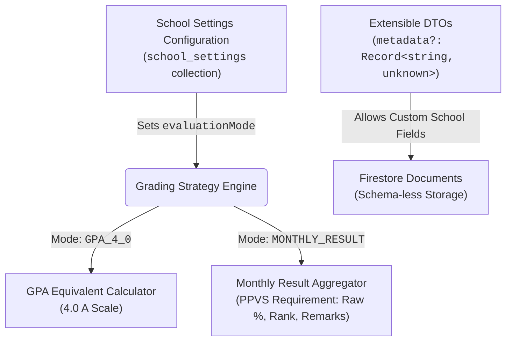

# Open-Source Classroom Customization & Grading Strategy

When building the **PPVS Online Classroom Management System** as an open-source platform intended for general adoption across different schools and educational institutes, one key architectural challenge arises: **Different institutions have drastically different grading policies, evaluation cycles, and data collection requirements.**

For example:

- **International / University-style classrooms** often require standard **GPA ($4.0\text{ A}$ scale)** or credit-weighted term grades.
- **PPVS (Phnom Penh Vocational/Language Classrooms)** does not use GPA; instead, they require **Monthly Student Results** (monthly percentage, class rank, attendance engagement for the month, and teacher remarks).
- **Primary / Specialized institutes** might use **Pass/Fail** or custom letter bands.

This document outlines our architectural blueprint and actionable engineering steps to make our **NestJS + Firebase Firestore** codebase flexible and adaptable so any school can customize data collection fields and grading engines out-of-the-box without rewriting core backend code.

---

## 1. Why NoSQL (Firestore) is an Open-Source Superpower Here

In relational SQL databases (like PostgreSQL or MySQL), changing classroom requirements forces developers to write rigid `ALTER TABLE` migrations to add columns for `monthlyRank` or `khmerGradeEquivalent`. If an open-source adopter upgrades the repo, conflicting SQL migrations can break their database.

Because **Google Cloud Firestore is schema-less by nature**, every document in a collection (`assessments`, `student_grades`, `enrollments`) can store flexible, school-specific attributes without breaking database schemas or requiring migration scripts.

---

## 2. Architectural Blueprint: The 3 Pillars of Customization

To support both **PPVS Monthly Results** and **General GPA Classrooms** cleanly, we implement three architectural pillars:



### Pillar 1: Configurable School Settings (`school_settings`)

Instead of hardcoding the grading formula directly into `AssessmentsService`, we introduce a global configuration or tenant settings document in Firestore (`school_settings/config` or environment variable `GRADING_POLICY_MODE`):

```json
{
  "schoolName": "PPVS Online Classroom",
  "currency": "KHR",
  "evaluationMode": "MONTHLY_RESULT", // Options: "GPA_4_0" | "MONTHLY_RESULT" | "PASS_FAIL" | "CUSTOM_RUBRIC"
  "attendanceStatuses": ["present", "homeworked", "permission", "absent"]
}
```

### Pillar 2: Extensible DTOs via `metadata` (`Record<string, unknown>`)

To let different schools attach custom fields (such as `monthlyRank`, `khmerLiteracyScore`, or `parentCheckTimestamp`) without modifying TypeScript classes, every core DTO includes an optional `metadata` property:

```typescript
// src/modules/assessments/dto/create-assessment.dto.ts
import { IsOptional, IsObject } from "class-validator";

export class CreateAssessmentDto {
  // ... standard fields: classId, title, maxScore, dueDate ...

  @IsOptional()
  @IsObject()
  metadata?: Record<string, unknown>; // Stores custom school-specific attributes cleanly
}
```

When validated and stored via `FirestoreBaseService<T>`, any custom school data inside `metadata` is preserved cleanly in Firestore (`data as unknown as Record<string, unknown>`).

### Pillar 3: Modular Grading Strategy Pattern (`Strategy Engine`)

In `AssessmentsService`, we structure `getStudentPerformanceSummary` to dynamically execute the appropriate evaluation logic depending on the active `evaluationMode`:

#### A. When `evaluationMode === 'GPA_4_0'` (Standard International Scale)

Aggregates total scores across the term/semester and converts the percentage into GPA letter equivalents:

- $\ge 90\% \rightarrow 4.0\text{ (A)}$
- $\ge 80\% \rightarrow 3.0\text{ (B)}$
- $< 60\% \rightarrow 0.0\text{ (F)}$

#### B. When `evaluationMode === 'MONTHLY_RESULT'` (PPVS Requirement)

Instead of converting to a $4.0$ GPA, the service accepts an optional `month` parameter (`2026-07`) and computes:

1. **Monthly Percentage**: $\frac{\sum \text{Earned Scores in Month}}{\sum \text{Max Scores in Month}} \times 100\%$
2. **Monthly Class Rank**: Compares the student's monthly percentage against classmates in the same `classId`.
3. **Monthly Attendance Engagement**: Queries `AttendanceService` for sessions specifically during that month (`present + homeworked`).
4. **Monthly Remarks**: Aggregates teacher comments stored in `student_grades.comments` or `metadata.remarks`.

---

## 3. How Open-Source Adopters Configure Their Classroom

When a new institution sets up the repository:

1. They edit `GEMINI.md` or `src/config/school.config.ts` to set their active `currency` (`KHR` / `USD`) and `evaluationMode` (`MONTHLY_RESULT` / `GPA_4_0`).
2. If they need extra custom fields on registration forms, assessments, or student profiles, their frontend simply sends those fields inside the `metadata: { ... }` JSON payload.
3. The NestJS backend automatically stores, validates, and returns those flexible fields through `FirestoreBaseService<T>` without requiring any backend table modifications!
