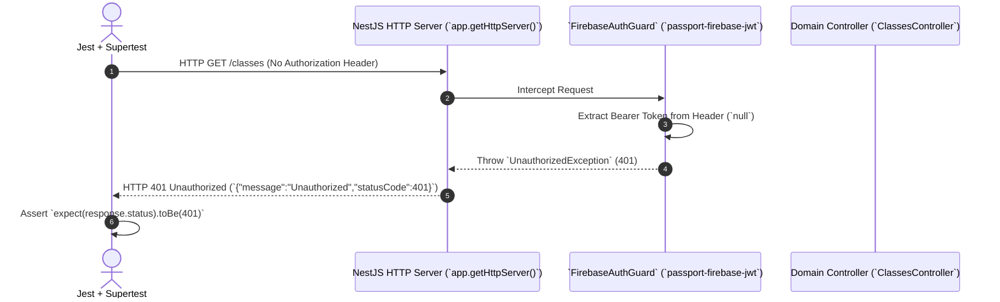

# Technical Testing Stack Guide — Easy Technical Reference

This document provides a clean, easy-to-understand technical explanation of the testing stack used in the **PPVS Online Classroom Management System**. It is designed for engineers and open-source contributors who want to understand how our test infrastructure operates under the hood without getting lost in unnecessary complexity.

---

## 1. The Core Technology Stack

Our automated testing infrastructure combines 5 core technologies working together:

| Technology                                      | Role in Testing Stack                          | Technical Purpose                                                                                                                                                                             |
| :---------------------------------------------- | :--------------------------------------------- | :-------------------------------------------------------------------------------------------------------------------------------------------------------------------------------------------- |
| **Jest**                                        | Test Runner & Assertion Engine                 | Executes `.spec.ts` files, manages parallel worker processes, runs `beforeAll/afterAll` lifecycle hooks, and asserts expected results (`expect().toEqual()`).                                 |
| **NestJS `@nestjs/testing`**                    | Dependency Injection Sandbox (`TestingModule`) | Creates an isolated NestJS application context inside memory (`Test.createTestingModule`) where services, controllers, and mocks are dynamically injected.                                    |
| **Local Firestore Emulator (`127.0.0.1:8080`)** | NoSQL Sandbox Database                         | A local Java/Go-based in-memory replica of Google Cloud Firestore. Keeps tests fast ($\sim 50\text{ms}$ per query) and prevents dirtying live production collections.                         |
| **Supertest**                                   | HTTP End-to-End Simulation                     | Simulates real HTTP requests (`GET /classes`, `POST /attendance`) against the NestJS HTTP server during end-to-end (`e2e`) tests without needing to open a browser or bind to a network port. |
| **Jest `moduleNameMapper`**                     | ES Module Stubbing (`jose.mock.js`)            | Intercepts problematic pure ES Module dependencies (`jose` used by `jwks-rsa`/`firebase-admin`) during Jest's CommonJS runtime and redirects them to lightweight mock objects.                |

---

## 2. How Unit & Integration Tests Work Under the Hood

When you run `npm run test`, Jest executes our domain specifications (e.g., `attendance.service.spec.ts`, `assessments.service.spec.ts`). Here is the exact technical flow:

### A. Bootstrapping the Isolated Module (`beforeAll`)

Inside `beforeAll()`, we build a virtual NestJS module containing only the service we want to test alongside our `FirebaseModule` and any mocked dependencies:

```typescript
const module: TestingModule = await Test.createTestingModule({
  imports: [FirebaseModule],
  providers: [
    AssessmentsService,
    { provide: StudentsService, useValue: mockStudentsService },
    { provide: AuditLogsService, useValue: mockAuditLogsService },
  ],
}).compile();

// Mandatory step: Triggers FirebaseService.onModuleInit()
await module.init();
service = module.get<AssessmentsService>(AssessmentsService);
```

**Why `await module.init()` is crucial**:
By calling `init()`, NestJS triggers lifecycle hooks (`onModuleInit`), allowing `FirebaseService` to check environment configurations (`process.env.FIRESTORE_EMULATOR_HOST`) and establish a live socket connection to `127.0.0.1:8080`.

### B. Executing `FirestoreBaseService<T>` CRUD Methods

Because domain services inherit from `FirestoreBaseService<T>`, when a test calls `await service.create(dto)`:

1. `formatCreatePayload(dto)` attaches ISO timestamps (`createdAt`, `updatedAt`).
2. `this.firebase.firestore.collection(this.collectionName).add(formattedData)` sends an RPC over HTTP/2 to the local emulator on port 8080.
3. The emulator immediately creates the document and returns a simulated Firestore Document Reference ID (`docRef.id`).
4. The service wraps and returns `{ id: docRef.id, message: "successfully created..." }`.

### C. Guaranteeing Idempotency with Timestamp Suffixes (`Date.now()`)

Because Jest spawns **multiple parallel worker processes (`jest --maxWorkers=4`)** when running across multiple test files, two different files running simultaneously might clash if they hardcode the same document IDs (e.g., `class_1`).
To guarantee strict technical idempotency:

```typescript
const runId = Date.now();
const classId = `class_assess_wf_${runId}`;
```

Every parallel worker generates a unique millisecond timestamp (`1752659123000`), ensuring complete isolation across parallel database transactions.

---

## 3. How End-to-End (E2E) Tests Work Under the Hood

When you run `npm run test:e2e`, Jest uses `test/jest-e2e.json` to execute `test/app.e2e-spec.ts`. This tests the entire HTTP request lifecycle:



1. **`Test.createTestingModule({ imports: [AppModule] })`**: Boots the entire application module tree, initializing controllers, guards, and services.
2. **`request(app.getHttpServer()).get('/classes')`**: Supertest sends a synthetic HTTP request to NestJS.
3. **Guard Interception**: Before reaching `ClassesController`, the request hits `FirebaseAuthGuard`. Because no valid Firebase ID Token is attached in the `Authorization: Bearer <JWT>` header, the guard throws `401 Unauthorized`, which Supertest captures and verifies.

---

## 4. Why ES Module (`jose.mock.js`) Stubbing is Needed

Node.js supports two module systems: **CommonJS (`require/module.exports`)** and **ES Modules (`import/export`)**.

- Jest runs by default inside a Node CommonJS environment.
- The `firebase-admin` SDK internally relies on `jwks-rsa`, which imports `jose` (a pure ES Module package).
- When Jest encounters `export * from ...` inside `node_modules/jose`, Node throws `SyntaxError: Unexpected token 'export'`.

### Our Technical Fix (`test/mocks/jose.mock.js` + `moduleNameMapper`)

Instead of forcing expensive Babel/ESM Jest transformations across all dependencies, we configure Jest to map any import of `jose` directly to our mock stub during test execution:

```json
// package.json ("jest" configuration)
"moduleNameMapper": {
  "^jose$": "<rootDir>/../test/mocks/jose.mock.js"
}
```

When `jwks-rsa` calls `jose.jwtVerify()` or `jose.createRemoteJWKSet()` inside a test, it executes our lightweight `jose.mock.js` stub, bypassing the ES Module syntax error and allowing fast test execution.
